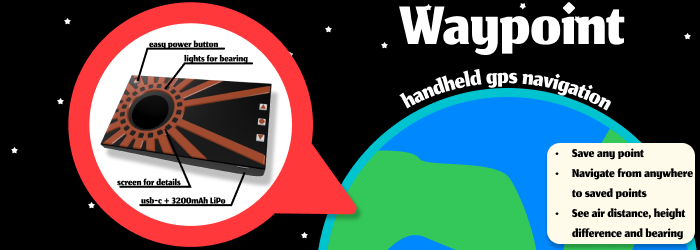
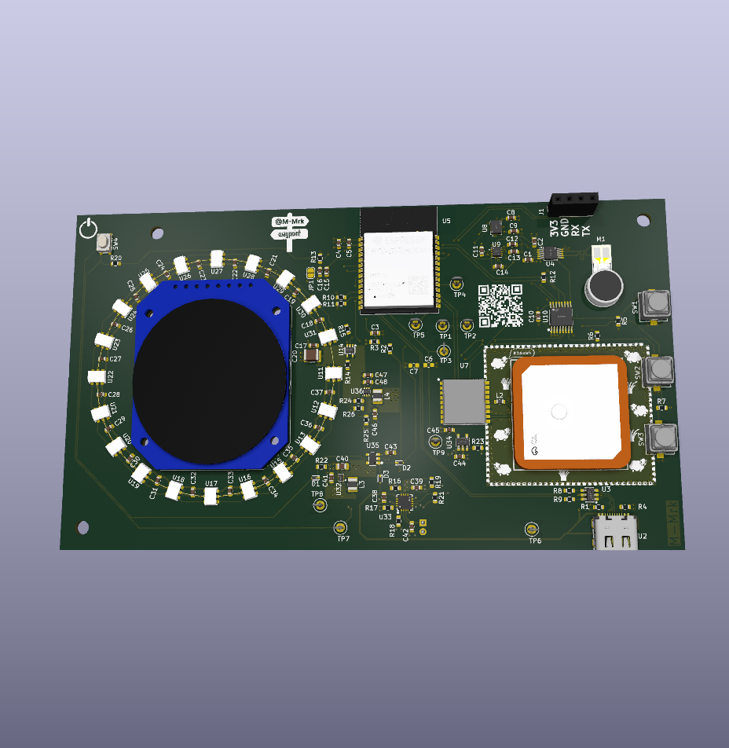
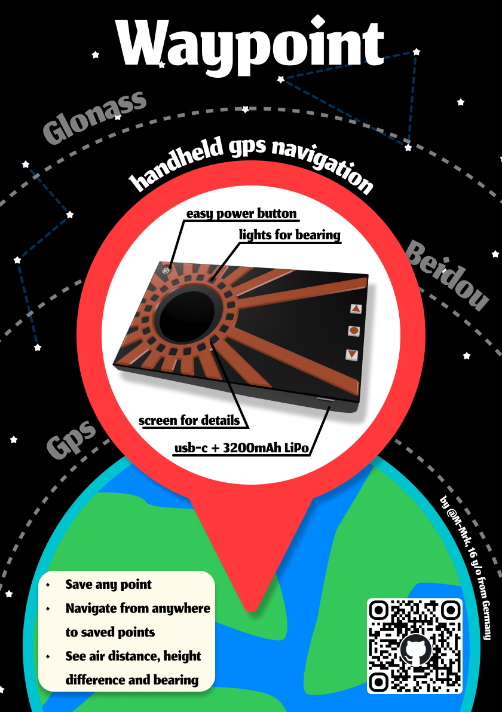

# Waypoint
A handheld GNSS navigation device designed to help you to get to a destination without relying on mobile reception.

Ever wanted to get somewhere from anywhere? Waypoint uses GNSS to guide you towards your destination by showing the direction, distance, and elevation difference. It does not provide turn-by-turn routes, but instead gives you the all other needed information to navigate independently.

It is powered by a 3200mAh LiPo battery, an efficient MCU, and separated power domains to achieve long battery life.

## How to use it

1. Save your current location
2. Travel somewhere else
3. Select your saved location
4. Navigate back using the provided direction and distance information

## Why

I built Waypoint for [Fallout 2026](https://fallout.hackclub.com) because I wanted to create a project involving RF and battery management.

With this project I learned a lot about embedded Rust with the embassy framework.

## Specs
- 20 sk6812s LEDs to indicate the needed bearing
- 240x240 GC9A01 oled screen
- ATGM336H GNSS module
- Esp32-c6
- usb-c charging
- imu + magnetometer
- haptics (DRV2605L + LRE)

# Pictures
## Full assembly
TODO: add image

## PCB

## Magazine page

# Build it yourself
## PCB
Order all components from the [bom](bom.csv) from your prefered site. It already includes links to lcsc and aliexpress. Also order the pcb from the [releases](https://github.com/M-Mrk/waypoint/releases) with the gerbers. I would recommend getting a stencil as the design includes some tricky footprints.

## Soldering
Start by soldering all smd components, then do all the tht ones.

## Case
Print all .3mf files in [here](case/printable). Printing the top and bottom in different colors gives it a nice touch! See the example images for inspiration.

## Assembly
- Stick the battery in the bottom of the case and connected it to the pcb (please make sure that the batteries polarity matches the pcbs)
- Press the pcb into the bottom. Align it with the posts
- The top requires some force to press on, as it uses snap fits. If there is too much friction sand the lip a bit down.
- Done